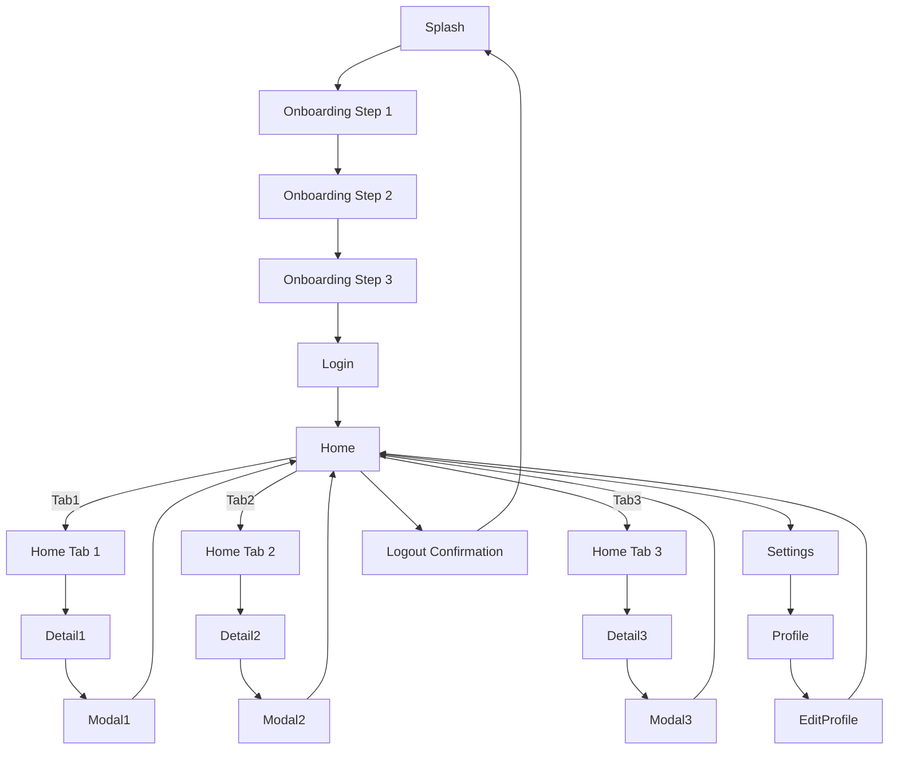

# UI/UX Placeholder Roadmap

## Screen Overview (100 placeholder screens)

| Screen | Type | MainComponents | Autolayout |
|--------|------|----------------|------------|
| Screen01 | Splash | Logo, App Name, Loading Indicator | Column+Spacer |
| Screen02 | Onboarding | Illustration, Title, Description, Next Button | Column+Spacer |
| Screen03 | Onboarding | Illustration, Title, Description, Next Button | Column+Spacer |
| Screen04 | Onboarding | Illustration, Title, Description, Next Button | Column+Spacer |
| Screen05 | Login | Email Input, Password Input, Login Button, Forgot Password Link | Column+Spacer |
| Screen06 | Signup | Name Input, Email Input, Password Input, Sign Up Button | Column+Spacer |
| Screen07 | Home | Top AppBar, Bottom Navigation, Featured Card List | Stack |
| Screen08 | List | Search Bar, Filter Chips, Item List (ListItem) | Column+Spacer |
| Screen09 | Detail | Image Header, Title, Description, Action Buttons | Column+Spacer |
| Screen10 | Modal | Title, Message, Confirm & Cancel Buttons | Column+Spacer |
| Screen11 | Form | TextFields, Switches, Submit Button | Column+Spacer |
| Screen12 | Settings | Preference Toggles, Account Info, Logout Button | Column+Spacer |
| Screen13 | Profile | Avatar, Name, Bio, Edit Button | Column+Spacer |
| Screen14 | Chat List | Search Bar, Conversation Tiles | Column+Spacer |
| Screen15 | Chat Detail | Message List, Input Field, Send Button | Column+Spacer |
| Screen16 | Notifications | List of Notification Tiles | Column+Spacer |
| Screen17 | Calendar | Month View, Event List, Add Event Button | Grid |
| Screen18 | Map | Map View, Search Bar, Pin Marker | Stack |
| Screen19 | Gallery | Grid of Images, Filter Bar | Grid |
| Screen20 | Photo Viewer | Image, Caption, Share Button | Column+Spacer |
| Screen21 | Video Player | Video Player, Controls, Description | Column+Spacer |
| Screen22 | Audio Player | Album Art, Playback Controls, Playlist | Column+Spacer |
| Screen23 | Search Results | Search Bar, Result List, Filters | Column+Spacer |
| Screen24 | FAQ | Accordion List, Search Bar | Column+Spacer |
| Screen25 | Help Center | Categories Grid, Search Bar | Grid |
| Screen26 | About | App Info, Version, Credits | Column+Spacer |
| Screen27 | Feedback | Rating Stars, Textarea, Submit Button | Column+Spacer |
| Screen28 | Terms & Conditions | Scrollable Text, Accept Button | Column+Spacer |
| Screen29 | Privacy Policy | Scrollable Text, Accept Button | Column+Spacer |
| Screen30 | Subscription Plans | Card List, Select Button | Column+Spacer |
| Screen31 | Purchase Confirmation | Summary, Payment Form, Confirm Button | Column+Spacer |
| Screen32 | Order History | List of Orders, Detail Link | Column+Spacer |
| Screen33 | Order Detail | Order Items, Status, Reorder Button | Column+Spacer |
| Screen34 | Wishlist | Product Grid, Add to Cart Buttons | Grid |
| Screen35 | Cart | Product List, Quantity Controls, Checkout Button | Column+Spacer |
| Screen36 | Checkout | Shipping Form, Payment Options, Place Order Button | Column+Spacer |
| Screen37 | Payment Methods | List of Cards, Add New Card Modal | Column+Spacer |
| Screen38 | Address Book | List of Addresses, Add/Edit Modal | Column+Spacer |
| Screen39 | Promotions | Carousel, Promo List | Column+Spacer |
| Screen40 | Referral Program | Invite Code, Share Buttons | Column+Spacer |
| Screen41 | Loyalty Points | Points Summary, Redemption Options | Column+Spacer |
| Screen42 | Live Support | Chat Interface, Agent Info, End Chat Button | Column+Spacer |
| Screen43 | Ticket List | List of Support Tickets, Status Badges | Column+Spacer |
| Screen44 | Ticket Detail | Conversation History, Reply Input | Column+Spacer |
| Screen45 | Blog List | Article Cards, Search Bar | Column+Spacer |
| Screen46 | Blog Detail | Article Content, Share Buttons, Comments | Column+Spacer |
| Screen47 | Forum List | Topic List, New Topic Button | Column+Spacer |
| Screen48 | Forum Thread | Posts, Reply Input, Like Buttons | Column+Spacer |
| Screen49 | Events Calendar | Month Grid, Event Cards | Grid |
| Screen50 | Event Detail | Image, Title, Description, RSVP Button | Column+Spacer |
| Screen51 | Ticket Purchase | Event Info, Ticket Options, Purchase Button | Column+Spacer |
| Screen52 | User Dashboard | Summary Cards, Quick Actions | Column+Spacer |
| Screen53 | Analytics Overview | Charts, Filters, Summary Stats | Column+Spacer |
| Screen54 | Report Generator | Form Inputs, Generate Button, Result Table | Column+Spacer |
| Screen55 | Settings – General | Toggles, Dropdowns, Save Button | Column+Spacer |
| Screen56 | Settings – Notifications | Switches, Frequency Picker, Save Button | Column+Spacer |
| Screen57 | Settings – Privacy | Options List, Save Button | Column+Spacer |
| Screen58 | Theme Selector | Color Palette Grid, Preview Area | Grid |
| Screen59 | Language Selector | List of Languages, Radio Buttons | Column+Spacer |
| Screen60 | Accessibility Options | Font Size Slider, Contrast Toggle | Column+Spacer |
| Screen61 | Profile Edit | Avatar Upload, TextFields, Save Button | Column+Spacer |
| Screen62 | Security Settings | Change Password Form, 2FA Toggle | Column+Spacer |
| Screen63 | Device Management | List of Devices, Revoke Button | Column+Spacer |
| Screen64 | Data Export | Export Options, Download Button | Column+Spacer |
| Screen65 | Data Import | File Picker, Import Button | Column+Spacer |
| Screen66 | Admin Panel – Users | User Table, Add User Button | Column+Spacer |
| Screen67 | Admin Panel – Roles | Role List, Permission Matrix | Column+Spacer |
| Screen68 | Admin Panel – Logs | Log List, Filter Bar | Column+Spacer |
| Screen69 | Admin Panel – Settings | Global Settings Form, Save Button | Column+Spacer |
| Screen70 | Multi‑step Wizard – Step1 | Intro Text, Continue Button | Column+Spacer |
| Screen71 | Multi‑step Wizard – Step2 | Form Fields, Next Button | Column+Spacer |
| Screen72 | Multi‑step Wizard – Step3 | Review Summary, Submit Button | Column+Spacer |
| Screen73 | Loading | Spinner, Message | Centered |
| Screen74 | Error | Error Icon, Message, Retry Button | Centered |
| Screen75 | Empty State | Illustration, Message, Action Button | Centered |
| Screen76 | Permission Request | Explanation Text, Allow/Deny Buttons | Column+Spacer |
| Screen77 | Location Access | Map Preview, Allow/Deny Buttons | Column+Spacer |
| Screen78 | Camera Access | Camera Preview, Capture Button, Cancel Button | Column+Spacer |
| Screen79 | File Picker | File List, Select Button, Cancel Button | Column+Spacer |
| Screen80 | QR Scanner | Camera View, Scan Indicator, Cancel Button | Column+Spacer |
| Screen81 | Push Notification Prompt | Message, Enable/Skip Buttons | Column+Spacer |
| Screen82 | In‑App Survey | Question Text, Options, Submit Button | Column+Spacer |
| Screen83 | Rating Prompt | Stars, Feedback Textarea, Submit Button | Column+Spacer |
| Screen84 | Upgrade Prompt | Feature List, Upgrade Button, Cancel Button | Column+Spacer |
| Screen85 | Beta Feature Toggle | Description, Enable Switch, Save Button | Column+Spacer |
| Screen86 | Debug Console | Log Output, Filter Dropdown, Clear Button | Column+Spacer |
| Screen87 | Performance Metrics | Charts, Time Range Selector | Column+Spacer |
| Screen88 | Network Settings | Wi‑Fi List, Connect Button, Add Network Modal | Column+Spacer |
| Screen89 | Bluetooth Devices | Device List, Pair Button, Disconnect Button | Column+Spacer |
| Screen90 | NFC Scan | Scan Prompt, Result Display, Retry Button | Column+Spacer |
| Screen91 | Voice Command Setup | Tutorial Steps, Enable Button | Column+Spacer |
| Screen92 | Accessibility Shortcut | Shortcut List, Enable Toggle | Column+Spacer |
| Screen93 | Logout Confirmation | Message, Confirm & Cancel Buttons | Centered |
| Screen94 | Delete Account | Warning Text, Confirm Deletion Button, Cancel Button | Centered |
| Screen95 | Account Recovery | Email Input, Send Link Button | Column+Spacer |
| Screen96 | Password Reset | New Password Fields, Reset Button | Column+Spacer |
| Screen97 | Two‑Factor Setup | QR Code, Input Code, Verify Button | Column+Spacer |
| Screen98 | Backup & Restore | Backup Button, Restore Button, Status messages | Column+Spacer |
| Screen99 | Sync Settings | Sync Toggle, Last Sync Info, Manual Sync Button | Column+Spacer |
| Screen100 | Final Screen | Thank You Message, Done Button | Centered |

## High‑Level Navigation Flowchart

*This flowchart provides a simplified navigation path from the splash screen through onboarding, authentication, the main home tabs, and back to logout.*
