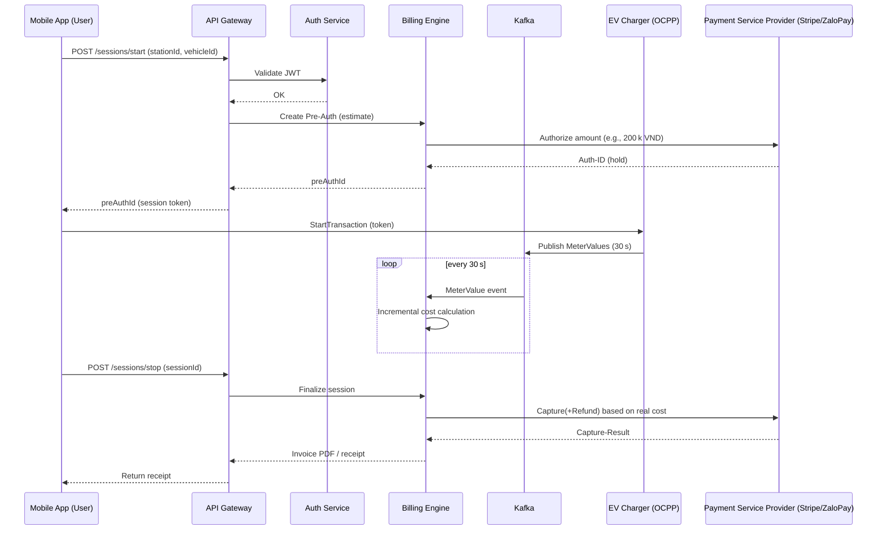

# VNEGREEN – Payment Solution Proposal for EV Charging Stations

---

## 1. Executive Summary

The VNEGREEN UI Kit is the front‑end layer for a full‑stack Electric‑Vehicle (EV) charging ecosystem.  This document expands the **payment & billing** domain into a concrete, production‑ready architecture that satisfies the following non‑functional goals:

- **High availability** (99.9 % SLA) – no single point of failure for charger‑to‑cloud communication.
- **Scalability** – support > 10 000 concurrent chargers and > 5 000 TPS on payment‑related APIs.
- **Low latency** – end‑to‑end charging‑session latency < 200 ms for status updates.
- **Security & compliance** – PCI‑DSS, ISO 15118, GDPR‑like data protection for Vietnamese market.
- **Observability** – centralized logs, metrics, tracing for quick incident response.

The solution is split into four technical pillars (as you already outlined) and enriched with concrete technology choices, data models, API contracts, and an actionable sprint‑by‑sprint roadmap.

---

## 2. System Architecture Overview

```mermaid
flowchart TD
    %% External actors
    MobileApp[Mobile App (Flutter)]
    WebPortal[Web Admin / Operator Portal]
    Charger[EV Charger (OCPP 1.6‑J / 2.0.1)]
    %% Core zones
    subgraph CSMS[CSMS Core]
        CSMS_WS[WebSocket OCPP Gateway]
        CSMS_Adapter[Protocol Adapter Layer]
        CSMS_HA[HA & Persistence]
    end
    subgraph Backend[Backend Services & API Gateway]
        API_GW[REST / GraphQL API GW]
        Auth[Identity & Auth Service]
        Billing[Billing Engine]
        Catalog[Station Catalog Service]
        Analytics[Analytics & Reporting]
        Payments[Payment Processor Wrapper]
    end
    subgraph Queue[Message Broker]
        Kafka[Apache Kafka]
    end
    subgraph DB[Databases]
        TimescaleDB[TimescaleDB (metric store)]
        Postgres[PostgreSQL (core data)]
        Redis[Redis (cache / session)]
    
    end
    subgraph Infra[Infrastructure]
        LB[Load Balancer (NGINX/HAProxy)]
        K8s[Kubernetes Cluster]
        CertMgr[Certificate Manager (CFSSL/Let’s Encrypt)]
    end
    %% Connectivity
    Charger -->|OCPP WS| CSMS_WS
    CSMS_WS -->|Events| Kafka
    CSMS_ADAPTER -->|Domain Events| Kafka
    Kafka -->|MeterValues, StatusNotification| Billing
    Kafka -->|StationMeta| Catalog
    Billing -->|Invoice, PaymentIntent| Payments
    Payments -->|PCI‑DSS Gateways| Stripe, ZaloPay, MoMo
    API_GW -->|REST/GraphQL| MobileApp
    API_GW -->|REST| WebPortal
    Auth -->|JWT/OAuth2.0| MobileApp & WebPortal
    Analytics -->|Aggregated Metrics| DB
    TimescaleDB -->|Time‑Series| Billing
    Postgres -->|Transactional| Auth, Catalog, Billing
    Redis -->|Cache| API_GW
    LB -->|HTTPS| API_GW & CSMS_WS
    K8s -->|Orchestrates| All Services
    CertMgr -->|TLS Certs| LB & CSMS_WS
```

### Core Zones Explained

| Zone | Responsibilities | Tech Choices |
|------|-------------------|--------------|
| **CSMS Core** | Handles OCPP WebSocket connections, validates messages, persists charger state, forwards telemetry to the broker. | Node.js (NestJS) + `ws` library **or** Go (`gorilla/websocket`). Deployed behind a **WebSocket‑aware** load balancer (NGINX, HAProxy). |
| **Backend & API Gateway** | Exposes public APIs for mobile/web, orchestrates business logic, provides authentication, aggregates data. | Kotlin‑SpringBoot **or** Go‑Gin for micro‑services; API‑gateway (Kong, Ambassador, or Spring Cloud Gateway). |
| **Message Broker** | Decouples real‑time charger telemetry from billing, guarantees ordered processing, supports replay. | Apache Kafka (3‑node cluster) with **topic per event type** (`meter-values`, `status-notif`). |
| **Databases** | Transactional data – users, stations, invoices. Time‑series data – meter readings, power curves. | PostgreSQL + TimescaleDB extension for high‑performance time‑series. Redis for caching JWTs and session state. |
| **Infrastructure** | Container orchestration, TLS termination, auto‑scaling, monitoring. | Kubernetes (GKE‑style managed), Helm charts, Prometheus + Grafana, Loki for logs, Jaeger for tracing. |

---

## 3. Protocol Integration Strategy

### 3.1 OCPP 1.6‑J (MVP)
- **Transport:** WebSocket over TLS (wss://). 
- **Message Flow:** `BootNotification → Authorize → StartTransaction → MeterValues → StopTransaction`.
- **Adapter Layer:** Normalizes JSON‑RPC to internal **Domain Events** (`ChargingSessionStarted`, `MeterValueReceived`, `ChargingSessionEnded`).
- **Fail‑over:** Each charger maintains a local FIFO buffer (SQLite) for unsent events; on reconnection, buffered events are replayed.

### 3.2 OCPP 2.0.1 (Future Phase)
- **Transport:** WebSocket with **mutual TLS (mTLS)** for enhanced security.
- **New Capabilities:** Smart Charging Profiles, Firmware Management, Remote Trigger.
- **Adapter Extension:** Implement version‑agnostic interface `IOcppAdapter` with concrete `Ocpp16Adapter` and `Ocpp20Adapter`.

### 3.3 ISO 15118 – Plug‑and‑Charge (Long‑term)
- **PKI Management:** Deploy a dedicated **Certificate Authority (CA)** using **EJBCA** or **CFSSL**. Store certificates in **HashiCorp Vault**.
- **Device Capability Detection:** Chargers report `SupportedFeatures` via OCPP 2.0.1; app falls back to QR‑code / RFID when ISO 15118 not available.
- **Integration Point:** After successful TLS handshake, the **Charging Session** is created using the **contract certificate** as the payer identity; billing engine receives the **contract ID** and maps it to a stored payment method.

---

## 4. Payment & Billing Flow

### 4.1 High‑Level Sequence Diagram


### 4.2 Pre‑Authorization (Escrow) Details
- **Amount estimate** = `max(estimated kWh × price_per_kWh, minimum_fee)`.  
- **Auth window**: 15 minutes; automatically extended if session exceeds the window.
- **Capture logic**: On `StopTransaction`, compute `actual_amount`. If `actual_amount < auth_amount`, issue **partial capture + refund**.

### 4.3 Offline / Buffering Strategy
1. Charger stores events locally (SQLite) when connectivity lost.
2. Upon reconnection, charger sends `BootNotification` with **buffered events** in order.
3. CSMS verifies sequence numbers, re‑publishes to Kafka, ensuring no double‑billing.
4. Billing engine checks for **duplicate transaction IDs** before final capture.

---

## 5. Security & Compliance

| Concern | Mitigation |
|---------|------------|
| **PCI‑DSS** – handling card data | All card details stay **inside** the Payment Service Provider (PSP) SDK; our back‑end only receives a **payment token** (PCI‑SAQ D minimal). |
| **Data Privacy (GDPR‑like)** | Encrypt PII at rest (PostgreSQL `pgcrypto`), enforce data‑subject‑access‑request (DSAR) endpoints. |
| **Transport Security** | TLS 1.3 everywhere, mTLS for OCPP‑2.0.1 connections. |
| **Authentication** | OAuth 2.0 + JWT with short‑lived access tokens (5 min) + refresh tokens. |
| **Authorization** | RBAC – roles: `CUSTOMER`, `OPERATOR`, `ADMIN`. |
| **Audit & Logging** | Immutable audit trail in **Kafka** (`audit-log` topic) + log aggregation via **Loki**. |
| **Secret Management** | HashiCorp Vault for DB passwords, API keys, TLS cert private keys. |

---

## 6. Observability & Ops

- **Metrics** (Prometheus): `charging_sessions_active`, `meter_values_per_sec`, `payment_success_rate`.
- **Tracing** (OpenTelemetry): end‑to‑end request ID from mobile app → API → Billing → PSP.
- **Alerting** (Alertmanager): latency > 200 ms, Kafka consumer lag > 5 seconds, payment failures > 1 %.
- **Dashboard** (Grafana): real‑time charger map, revenue per region, SLA health.

---

## 7. Detailed Technical Roadmap

| Sprint | Goal | Key Deliverables |
|--------|------|------------------|
| **1‑2** (Weeks 1‑2) | **Foundations** – infra, CI/CD, repo scaffolding. | Kubernetes cluster (dev), Helm charts, GitHub Actions pipeline, Vault secret store. |
| **3‑4** (Weeks 3‑4) | **CSMS Core (MVP)** – OCPP 1.6‑J WebSocket gateway + simulator. | `csms-gateway` service, Docker image, integration tests with OCPP‑Simulator, basic HA via 2‑pod replica set. |
| **5‑6** (Weeks 5‑6) | **Message Bus & Persistence** – Kafka + TimescaleDB schema. | Topics (`meter-values`, `status-notif`), schema migrations (Flyway), consumer service skeleton. |
| **7‑8** (Weeks 7‑8) | **Auth & User Service** – OTP, JWT, multi‑factor. | `auth-service`, OTP via Twilio/Viettel, DB tables (`users`, `devices`). |
| **9‑10** (Weeks 9‑10) | **Payment Integration – Local** – VietQR, ZaloPay. | `payment-service` wrapper, PSP SDK adapters, pre‑auth endpoint, sandbox testing. |
| **11‑12** (Weeks 11‑12) | **Billing Engine** – real‑time cost aggregation. | Event‑driven `billing-service`, price‑rules engine, invoice PDF generator. |
| **13‑14** (Weeks 13‑14) | **Mobile App MVP** – start/stop session, view invoice. | Flutter screens (Search, Map, Charging Session, Receipt), API client, end‑to‑end test flow. |
| **15‑16** (Weeks 15‑16) | **Offline Buffer & Recovery** – charger‑side buffering logic. | Firmware update simulation, reconnection replay tests. |
| **17‑18** (Weeks 17‑18) | **International Payments** – Stripe / Cybersource integration. | Card tokenization flow, PCI‑D compliance checklist, end‑to‑end capture/refund tests. |
| **19‑20** (Weeks 19‑20) | **Admin Dashboard** – station health, revenue reports. | React (or Flutter Web) portal, Grafana‑embedded panels, role‑based access. |
| **21‑22** (Weeks 21‑22) | **ISO 15118 Pilot** – PKI setup, contract‑certificate handling. | CA deployment, certificate issuance workflow, demo with ISO‑capable charger simulator. |
| **23‑24** (Weeks 23‑24) | **Performance & Scaling Test** – load‑test OCPP gateway (10k concurrent), payment burst (5 k TPS). | k6/JMeter scripts, autoscaling policy fine‑tuning, SLA verification report. |

> **Milestone 1 (Week 12)** – End‑to‑end charging session with local payment (VietQR) works in dev.
> **Milestone 2 (Week 20)** – International card payments added, admin portal live.
> **Milestone 3 (Week 24)** – Full‑scale HA production readiness + ISO 15118 proof‑of‑concept.

---

## 8. Risks & Mitigations

| Risk | Impact | Mitigation |
|------|--------|------------|
| **Connector fragmentation** (OCPP 1.6 vs 2.0) | Integration delays | Build **adapter abstraction** early; support both versions in parallel.
| **PCI‑DSS certification** | Regulatory blockers | Use **PSP‑hosted** checkout, store only tokens, run third‑party audit early.
| **Network outages at charger** | Revenue loss, user frustration | Charger‑side buffer + **idempotent** session handling; fallback to offline QR payment.
| **Scaling Kafka** | Message loss or latency | Deploy **replicated partitions**, enable **log compaction**, monitor consumer lag.
| **PKI complexity for ISO 15118** | Delayed rollout | Start with internal CA, automate certificate lifecycle via Vault‑agent.

---

## 9. Glossary

- **CSMS** – Central System Management Server (OCPP backend). 
- **PSP** – Payment Service Provider (Stripe, ZaloPay, MoMo, etc.).
- **Pre‑auth / Escrow** – Temporary hold on a card before final amount is known.
- **mTLS** – Mutual TLS, both client and server present certificates.
- **PKI** – Public Key Infrastructure.
- **OCPP** – Open Charge Point Protocol.
- **ISO 15118** – Standard for Plug‑and‑Charge, enabling certificate‑based authentication.

---

*Prepared on 2026‑10‑06 for the Chief Architect review.*
